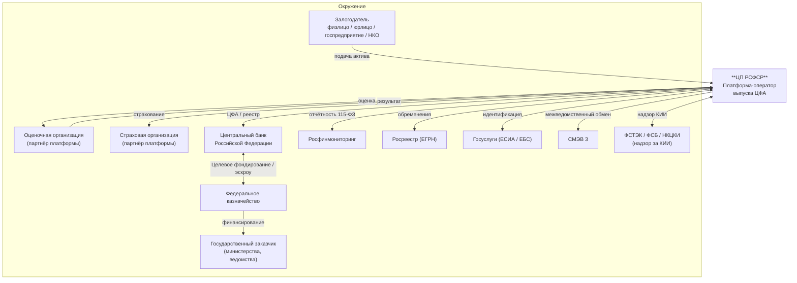
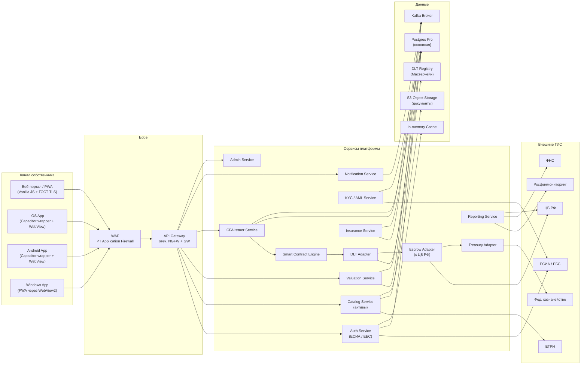
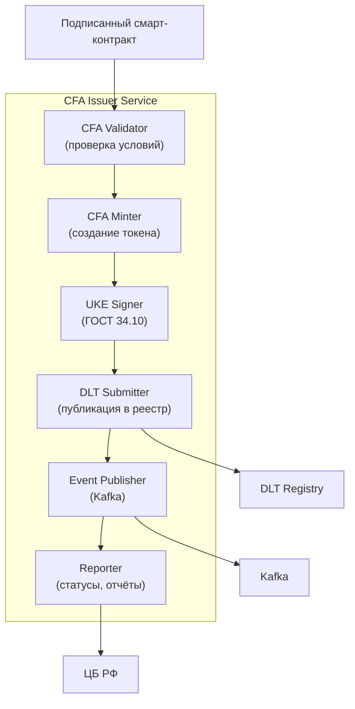
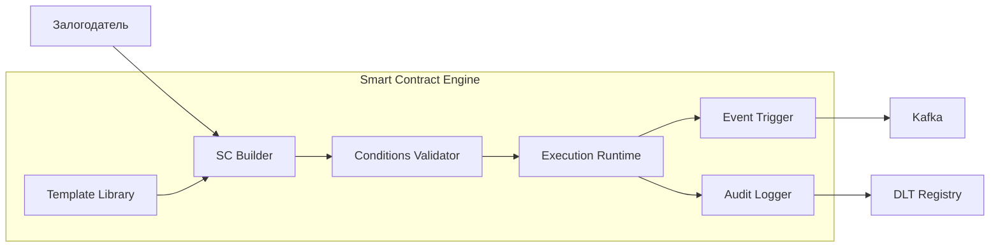
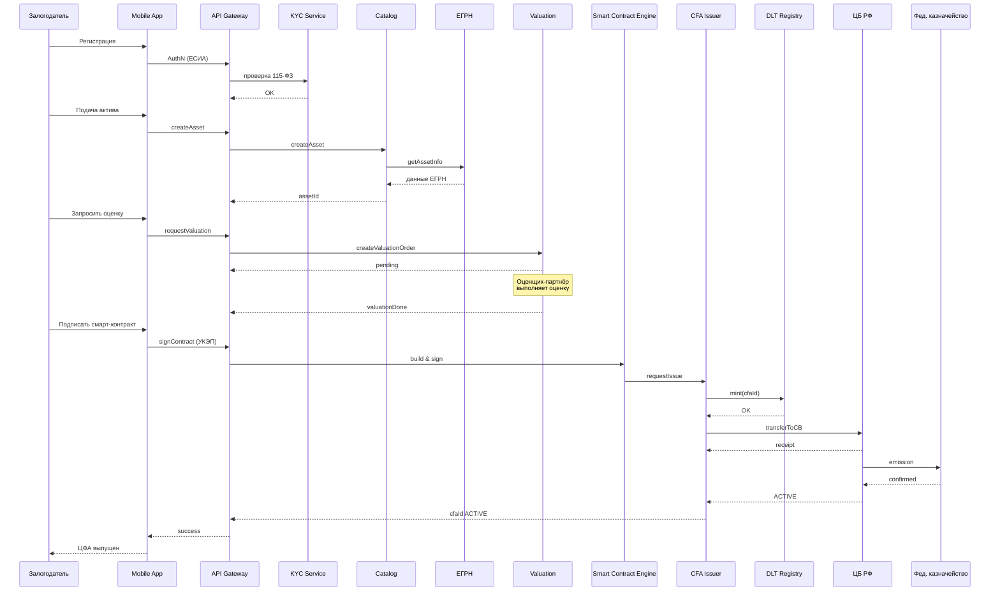
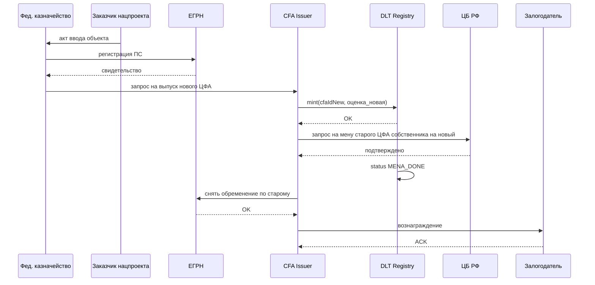

# Архитектурные диаграммы ЦП РСФСР

Документ содержит описания С4-диаграмм платформы в текстовом виде (Mermaid + структурированное описание). Визуальные диаграммы будут разработаны дизайнером в составе сопровождающего пакета.

---

## 1. C4 — Level 1: System Context



### Описание
ЦП РСФСР — центральная платформа, соединяющая четыре типа стейкхолдеров:
- **Собственники активов** — физические и юридические лица, государственные предприятия, НКО, фонды.
- **Партнёры** — оценочные и страховые организации, аккредитованные платформой.
- **Регуляторы** — Банк России, Росфинмониторинг, ФСТЭК/ФСБ.
- **Государственные органы** — Федеральное казначейство и государственные заказчики нацпроектов.

---

## 2. C4 — Level 2: Containers



### Описание
Платформа состоит из трёх основных слоёв:
1. **Каналы** — веб и мобильные приложения залогодателя, плюс кабинеты партнёров.
2. **Edge + сервисы** — WAF, API Gateway, микросервисы.
3. **Данные + интеграции** — БД, объектное хранилище, DLT-реестр, кеш, брокер сообщений, внешние ГИС.

---

## 3. C4 — Level 3: Components (CFA Issuer Service)



---

## 4. C4 — Level 3: Components (Smart Contract Engine)



---

## 5. Deployment Diagram (упрощённая)

```mermaid
graph TB
    subgraph "ЦОД-1 (Центральный ФО)"
        K8S1["k8s cluster #1"]
        PG1["Postgres Pro #1"]
        DLT1["DLT Node #1"]
        HSM1["HSM #1"]
    end
    subgraph "ЦОД-2 (Уральский ФО)"
        K8S2["k8s cluster #2"]
        PG2["Postgres Pro #2"]
        DLT2["DLT Node #2"]
        HSM2["HSM #2"]
    end
    subgraph "ЦОД-3 (Сибирский ФО)"
        K8S3["k8s cluster #3"]
        PG3["Postgres Pro #3"]
        DLT3["DLT Node #3"]
        HSM3["HSM #3"]
    end
    subgraph "DR ЦОД (резервный)"
        K8S4["k8s cluster (cold)"]
        BACK["Backup storage"]
    end

    K8S1 <--> K8S2
    K8S2 <--> K8S3
    K8S1 <--> K8S3
    PG1 <-->|sync repl| PG2
    PG2 <-->|sync repl| PG3
    DLT1 <-->|consensus| DLT2
    DLT2 <-->|consensus| DLT3
    DLT1 <-->|consensus| DLT3
    BACK <-- K8S1
    BACK <-- K8S2
    BACK <-- K8S3
```

### Описание
- Active-active-active топология по 3 ЦОД, расположенных в разных федеральных округах.
- Синхронная репликация баз данных.
- Распределённый консенсус DLT-узлов.
- Резервный «холодный» ЦОД для DR-сценариев.

---

## 6. Sequence — выпуск ЦФА (E2E)



---

## 7. Sequence — мена ЦФА



---

## 8. Замечания

- Все диаграммы — концептуальные, на стадии MVP подлежат детализации.
- Визуальные C4-диаграммы будут отрисованы дизайнером по бренд-буку платформы.
- Возможна детализация Mermaid → PlantUML / ArchiMate в зависимости от инструментария команды.
