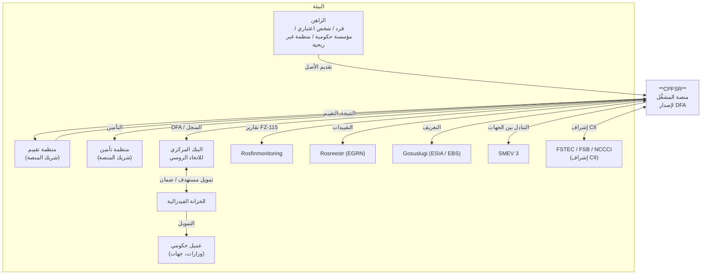
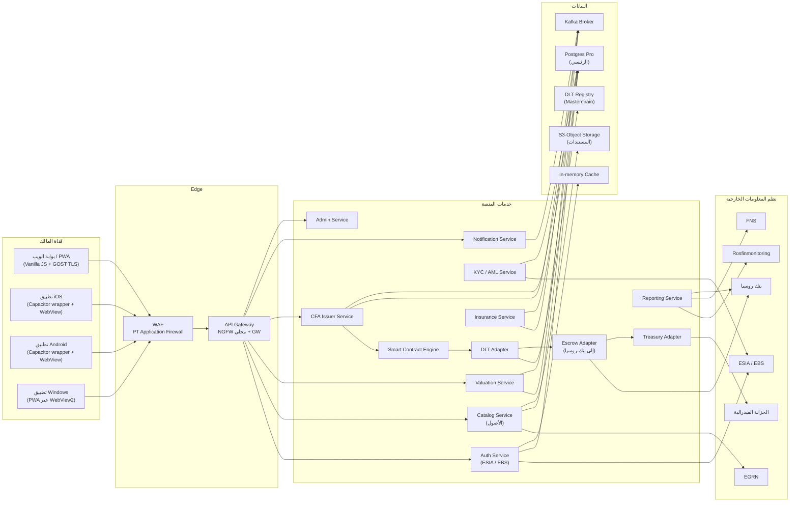
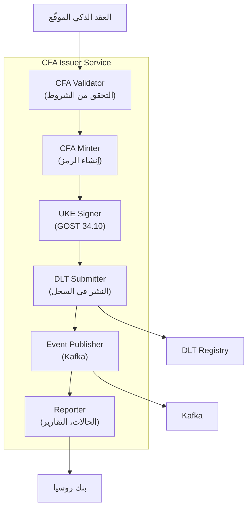
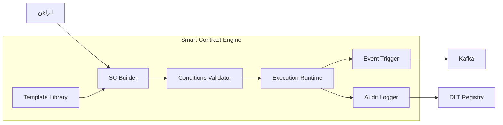
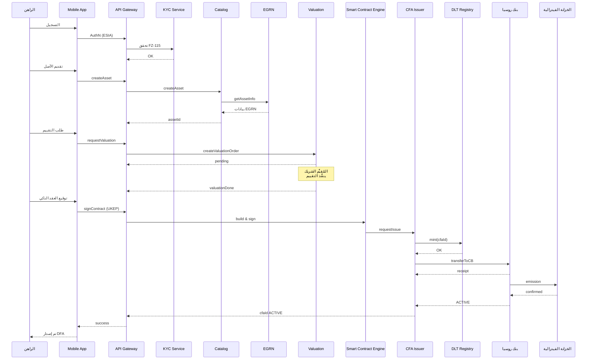
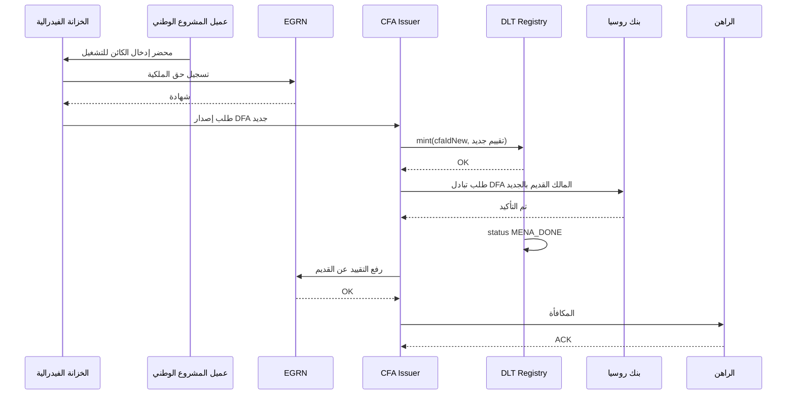

# المخططات المعمارية لـ CPFSR

يحتوي المستند على أوصاف نصية لمخططات C4 للمنصة (Mermaid + وصف منظَّم). تُعدّ المخططات المرئية بواسطة مصمِّم ضمن الحزمة المرافقة.

---

## 1. C4 — المستوى 1: System Context



### الوصف
CPFSR هي المنصة المركزية التي تربط أربعة أنواع من أصحاب المصلحة:
- **مالكو الأصول** — الأشخاص الطبيعيون والاعتباريون، المؤسسات الحكومية، المنظمات غير الربحية، المؤسسات.
- **الشركاء** — منظمات التقييم والتأمين المعتمدة من المنصة.
- **الجهات التنظيمية** — بنك روسيا، Rosfinmonitoring، FSTEC/FSB.
- **الجهات الحكومية** — الخزانة الفيدرالية والعملاء الحكوميون للمشاريع الوطنية.

---

## 2. C4 — المستوى 2: Containers



### الوصف
تتكوّن المنصة من ثلاث طبقات رئيسية:
1. **القنوات** — تطبيقات الويب والهاتف للراهن، إضافة إلى حسابات الشركاء.
2. **Edge + الخدمات** — WAF، API Gateway، الخدمات المصغّرة.
3. **البيانات + التكاملات** — قواعد البيانات، التخزين الكائني، سجل DLT، التخزين المؤقت، وسيط الرسائل، نظم المعلومات الخارجية.

---

## 3. C4 — المستوى 3: Components (CFA Issuer Service)



---

## 4. C4 — المستوى 3: Components (Smart Contract Engine)



---

## 5. Deployment Diagram (مبسَّط)

```mermaid
graph TB
    subgraph "مركز البيانات 1 (المقاطعة الفيدرالية الوسطى)"
        K8S1["k8s cluster #1"]
        PG1["Postgres Pro #1"]
        DLT1["DLT Node #1"]
        HSM1["HSM #1"]
    end
    subgraph "مركز البيانات 2 (مقاطعة الأورال)"
        K8S2["k8s cluster #2"]
        PG2["Postgres Pro #2"]
        DLT2["DLT Node #2"]
        HSM2["HSM #2"]
    end
    subgraph "مركز البيانات 3 (مقاطعة سيبيريا)"
        K8S3["k8s cluster #3"]
        PG3["Postgres Pro #3"]
        DLT3["DLT Node #3"]
        HSM3["HSM #3"]
    end
    subgraph "مركز DR (احتياطي)"
        K8S4["k8s cluster (cold)"]
        BACK["Backup storage"]
    end

    K8S1 <--> K8S2
    K8S2 <--> K8S3
    K8S1 <--> K8S3
    PG1 <-->|sync repl| PG2
    PG2 <-->|sync repl| PG3
    DLT1 <-->|consensus| DLT2
    DLT2 <-->|consensus| DLT3
    DLT1 <-->|consensus| DLT3
    BACK <-- K8S1
    BACK <-- K8S2
    BACK <-- K8S3
```

### الوصف
- طوبولوجيا active-active-active على 3 مراكز بيانات في مقاطعات اتحادية مختلفة.
- تكرار متزامن لقواعد البيانات.
- توافق موزَّع لعُقَد DLT.
- مركز بيانات «بارد» احتياطي لسيناريوهات DR.

---

## 6. Sequence — إصدار DFA (E2E)



---

## 7. Sequence — تبادل DFA



---

## 8. ملاحظات

- جميع المخططات مفاهيمية، وفي مرحلة MVP تخضع للتفصيل.
- يرسم المخططات المرئية C4 مصمِّم وفق بَرَنَد المنصة.
- يمكن تفصيل Mermaid → PlantUML / ArchiMate حسب أدوات الفريق.
