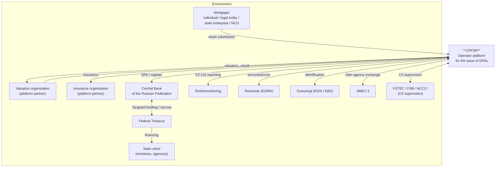
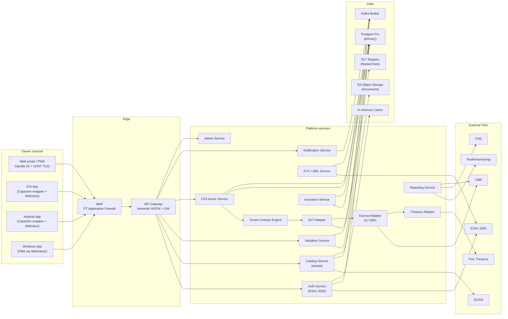
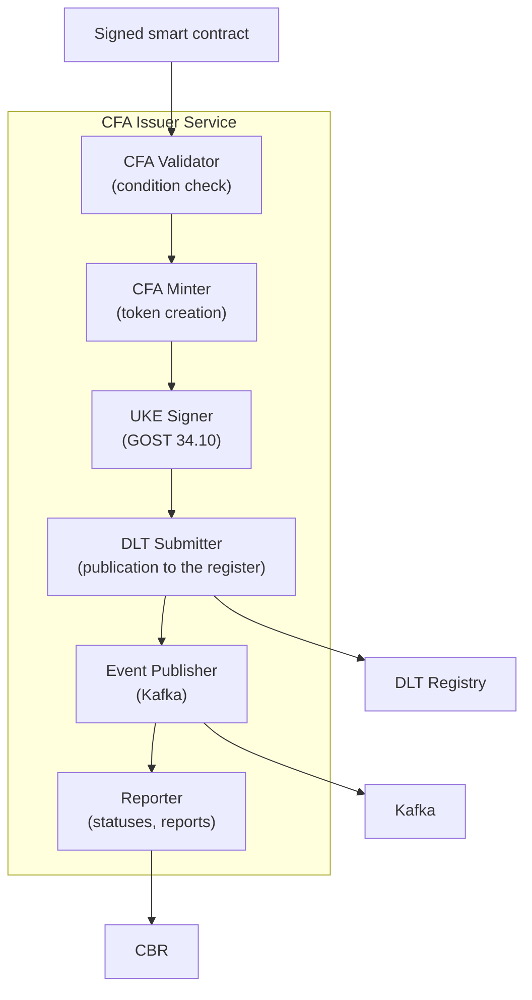
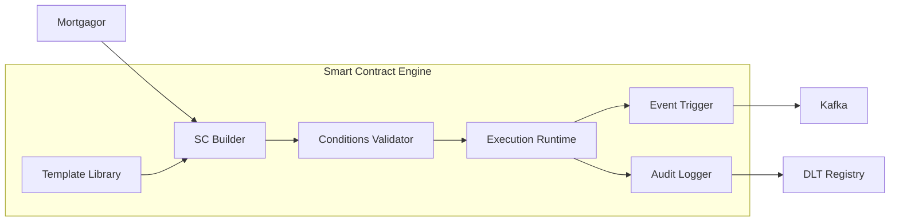
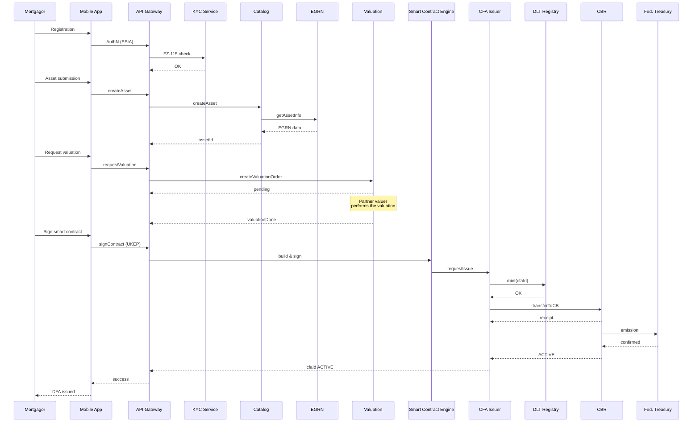
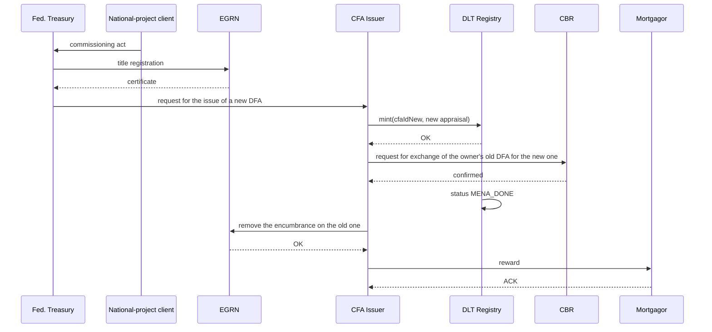

# Architecture diagrams of CPFSR

The document contains textual descriptions of the platform's C4 diagrams (Mermaid + structured description). The visual diagrams will be developed by a designer as part of the accompanying package.

---

## 1. C4 — Level 1: System Context



### Description
CPFSR is the central platform connecting four types of stakeholders:
- **Asset owners** — natural and legal persons, state enterprises, NCOs, foundations.
- **Partners** — valuation and insurance organisations accredited by the platform.
- **Regulators** — Bank of Russia, Rosfinmonitoring, FSTEC/FSB.
- **State bodies** — Federal Treasury and state clients of national projects.

---

## 2. C4 — Level 2: Containers



### Description
The platform consists of three main layers:
1. **Channels** — web and mobile applications of the mortgagor, plus partner cabinets.
2. **Edge + services** — WAF, API Gateway, microservices.
3. **Data + integrations** — DBs, object storage, DLT register, cache, message broker, external SISs.

---

## 3. C4 — Level 3: Components (CFA Issuer Service)



---

## 4. C4 — Level 3: Components (Smart Contract Engine)



---

## 5. Deployment Diagram (simplified)

```mermaid
graph TB
    subgraph "Data centre 1 (Central FD)"
        K8S1["k8s cluster #1"]
        PG1["Postgres Pro #1"]
        DLT1["DLT Node #1"]
        HSM1["HSM #1"]
    end
    subgraph "Data centre 2 (Ural FD)"
        K8S2["k8s cluster #2"]
        PG2["Postgres Pro #2"]
        DLT2["DLT Node #2"]
        HSM2["HSM #2"]
    end
    subgraph "Data centre 3 (Siberian FD)"
        K8S3["k8s cluster #3"]
        PG3["Postgres Pro #3"]
        DLT3["DLT Node #3"]
        HSM3["HSM #3"]
    end
    subgraph "DR Data centre (reserve)"
        K8S4["k8s cluster (cold)"]
        BACK["Backup storage"]
    end

    K8S1 <--> K8S2
    K8S2 <--> K8S3
    K8S1 <--> K8S3
    PG1 <-->|sync repl| PG2
    PG2 <-->|sync repl| PG3
    DLT1 <-->|consensus| DLT2
    DLT2 <-->|consensus| DLT3
    DLT1 <-->|consensus| DLT3
    BACK <-- K8S1
    BACK <-- K8S2
    BACK <-- K8S3
```

### Description
- Active-active-active topology across 3 data centres located in different federal districts.
- Synchronous DB replication.
- Distributed DLT-node consensus.
- A reserve "cold" data centre for DR scenarios.

---

## 6. Sequence — DFA issue (E2E)



---

## 7. Sequence — DFA exchange



---

## 8. Notes

- All diagrams are conceptual; at the MVP stage they are subject to detailing.
- Visual C4 diagrams will be drawn by a designer in line with the platform's brand book.
- A detailed Mermaid → PlantUML / ArchiMate transformation is possible depending on the team's tools.
