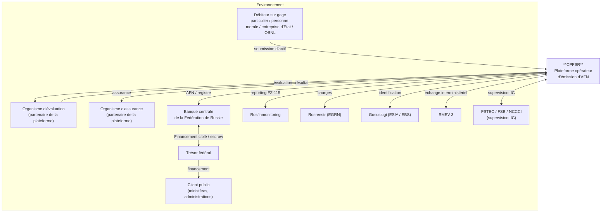
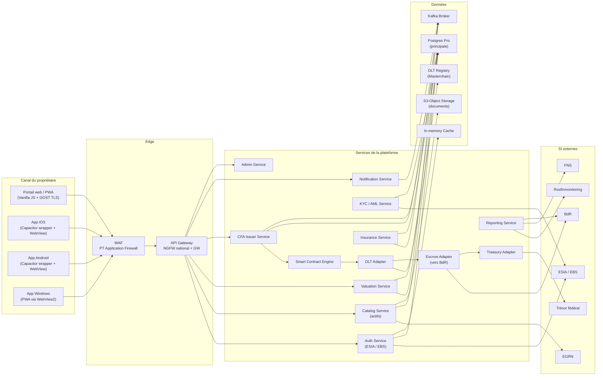
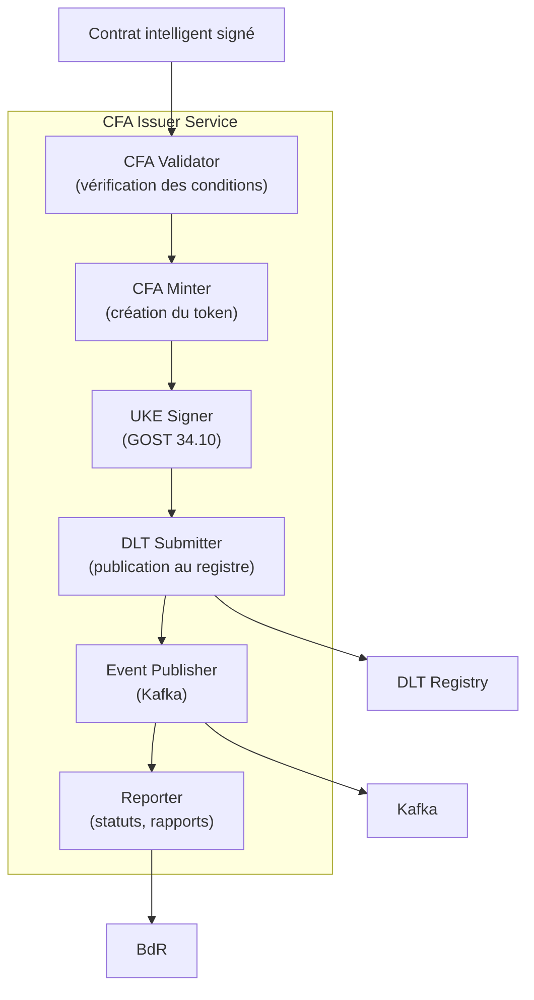
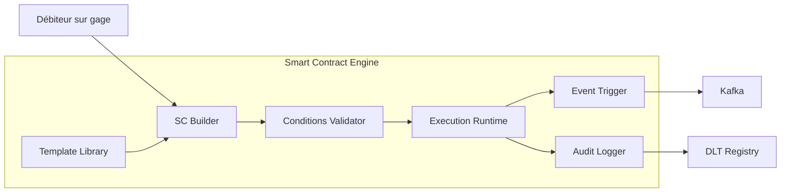
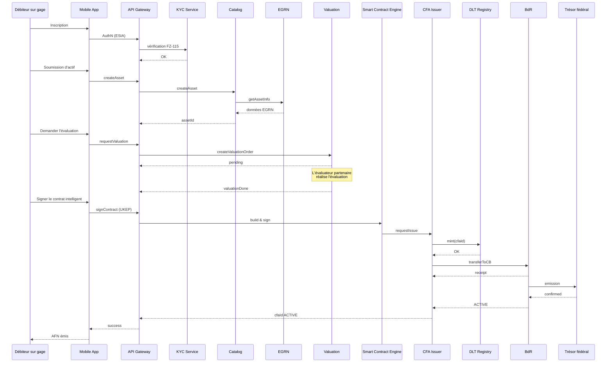
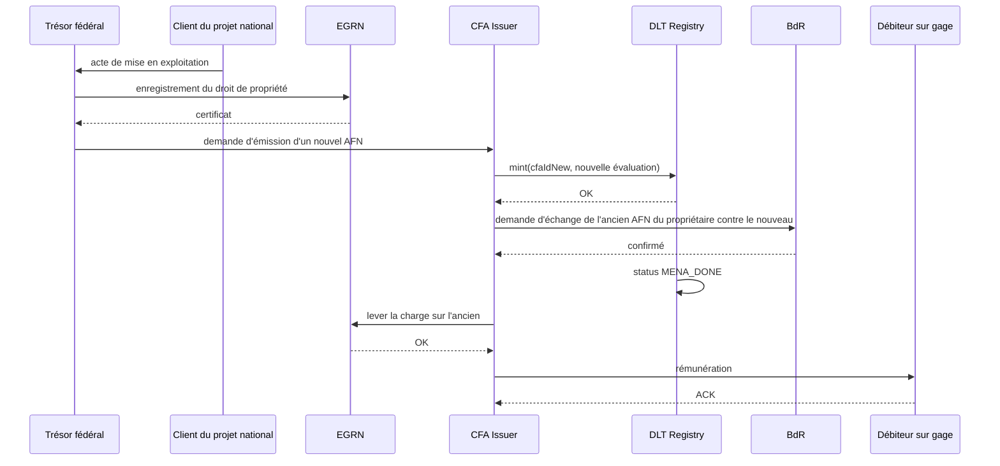

# Diagrammes d'architecture de CPFSR

Le document contient des descriptions textuelles des diagrammes C4 de la plateforme (Mermaid + description structurée). Les diagrammes visuels seront élaborés par un designer dans le cadre du pack d'accompagnement.

---

## 1. C4 — Niveau 1 : System Context



### Description
CPFSR est la plateforme centrale qui relie quatre types de parties prenantes :
- **Propriétaires d'actifs** — personnes physiques et morales, entreprises d'État, OBNL, fondations.
- **Partenaires** — organismes d'évaluation et d'assurance accrédités par la plateforme.
- **Régulateurs** — Banque de Russie, Rosfinmonitoring, FSTEC/FSB.
- **Organes étatiques** — Trésor fédéral et clients étatiques de projets nationaux.

---

## 2. C4 — Niveau 2 : Containers



### Description
La plateforme comporte trois couches principales :
1. **Canaux** — applications web et mobiles du débiteur sur gage, ainsi que les espaces partenaires.
2. **Edge + services** — WAF, API Gateway, microservices.
3. **Données + intégrations** — BD, stockage objet, registre DLT, cache, broker de messages, SI externes.

---

## 3. C4 — Niveau 3 : Components (CFA Issuer Service)



---

## 4. C4 — Niveau 3 : Components (Smart Contract Engine)



---

## 5. Deployment Diagram (simplifié)

```mermaid
graph TB
    subgraph "Centre de données 1 (DF Central)"
        K8S1["k8s cluster #1"]
        PG1["Postgres Pro #1"]
        DLT1["DLT Node #1"]
        HSM1["HSM #1"]
    end
    subgraph "Centre de données 2 (DF de l'Oural)"
        K8S2["k8s cluster #2"]
        PG2["Postgres Pro #2"]
        DLT2["DLT Node #2"]
        HSM2["HSM #2"]
    end
    subgraph "Centre de données 3 (DF de Sibérie)"
        K8S3["k8s cluster #3"]
        PG3["Postgres Pro #3"]
        DLT3["DLT Node #3"]
        HSM3["HSM #3"]
    end
    subgraph "Centre DR (de secours)"
        K8S4["k8s cluster (cold)"]
        BACK["Backup storage"]
    end

    K8S1 <--> K8S2
    K8S2 <--> K8S3
    K8S1 <--> K8S3
    PG1 <-->|sync repl| PG2
    PG2 <-->|sync repl| PG3
    DLT1 <-->|consensus| DLT2
    DLT2 <-->|consensus| DLT3
    DLT1 <-->|consensus| DLT3
    BACK <-- K8S1
    BACK <-- K8S2
    BACK <-- K8S3
```

### Description
- Topologie active-active-active sur 3 centres de données situés dans différents districts fédéraux.
- Réplication synchrone des BD.
- Consensus distribué des nœuds DLT.
- Centre de données « froid » de secours pour les scénarios DR.

---

## 6. Sequence — émission d'AFN (E2E)



---

## 7. Sequence — échange d'AFN



---

## 8. Remarques

- Tous les diagrammes sont conceptuels ; au stade MVP, ils sont sujets à un affinement.
- Les diagrammes visuels C4 seront dessinés par un designer conformément au brand book de la plateforme.
- Un détail Mermaid → PlantUML / ArchiMate est possible selon l'outillage de l'équipe.
